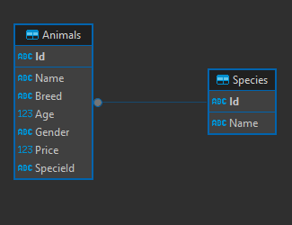
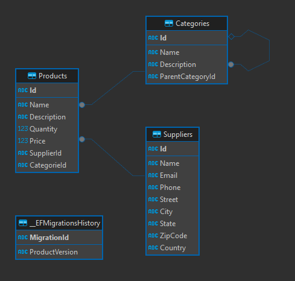
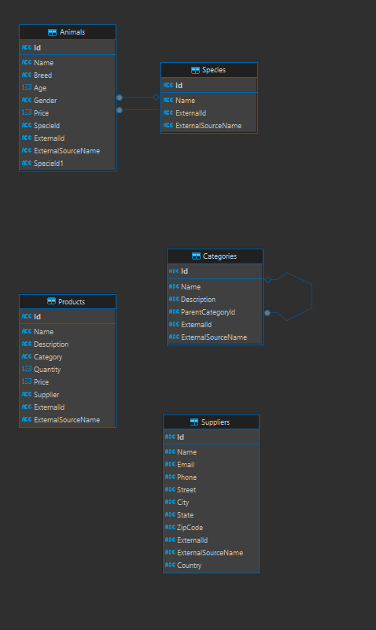
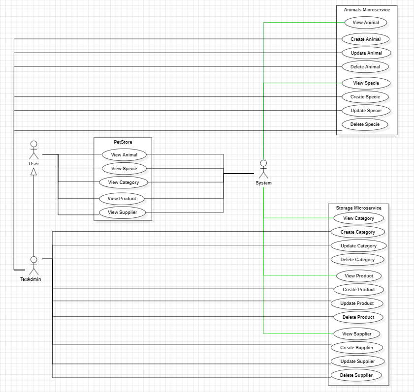
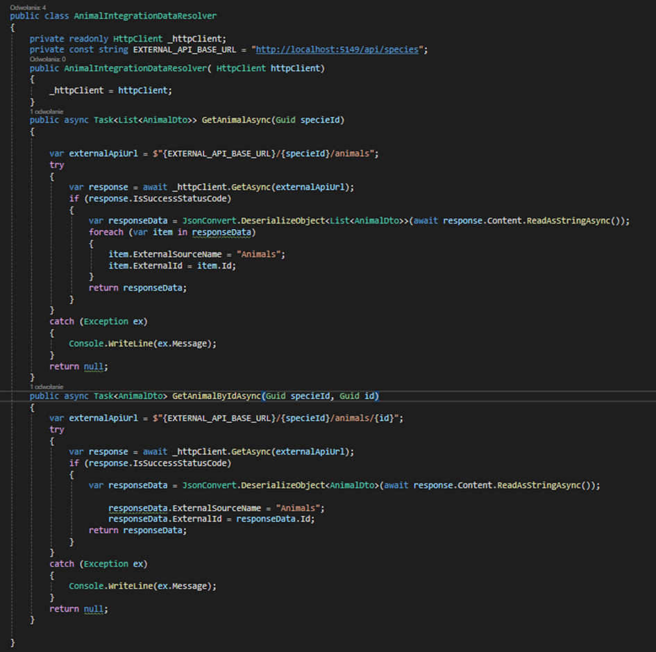
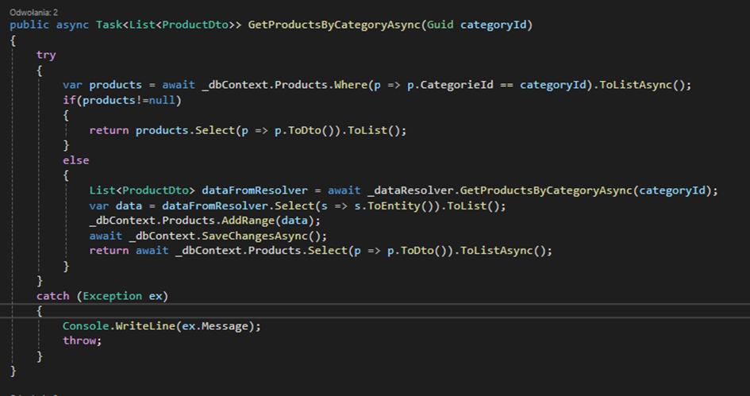

# Dokumentacja API dla mikroserwisów (animals, warehouse)

## 1. Opis Wybranego Tematu i Funkcjonalności Systemu

### Temat:
System zarządzania zwierzętami i magazynem składający się z dwóch mikroserwisów: "animals" do zarządzania danymi zwierząt oraz "warehouse" do zarządzania zapasami w magazynie.

### Funkcjonalności Systemu:
- **Mikroserwis Animals**:
    - Dodawanie, aktualizowanie i usuwanie danych zwierząt.
    - Przeglądanie listy zwierząt oraz szczegółowych informacji o każdym z nich.

- **Mikroserwis Warehouse**:
    - Zarządzanie zapasami, w tym dodawanie, aktualizowanie i usuwanie produktów.
    - Monitorowanie stanu magazynu oraz przeglądanie szczegółów dotyczących produktów.


### Podział Zadań:

#### Rafał

- **Mikroserwis Warehouse**:
    - Implementacja kontrolerów i serwisów do zarządzania danymi produktów.
    - Integracja z zewnętrznym API do pobierania danych o produktach.
    - Implementacja metod do pobierania listy produktów oraz szczegółowych informacji o produkcie.
- **Dokumentacja**:
    - Opis wybranego tematu i funkcjonalności systemu.
    - Opis wybranego stosu technologicznego.
    - Opis jak uruchomić aplikację.
    - Diagram bazy danych dla każdego mikroserwisu.
    - Diagram przypadków użycia.
#### Konrad
- **Mikroserwis Animals**:
    - Implementacja kontrolerów i serwisów do zarządzania danymi zwierząt.
    - Integracja z zewnętrznym API do pobierania danych o zwierzętach.
    - Implementacja metod do pobierania listy zwierząt oraz szczegółowych informacji o zwierzęciu.
- **Dokumentacja**:
    - Diagram UML.
    - Diagram przypadków użycia.
    - Opis interfejsu użytkownika.
    - Opis backendu.
#### Wspólnie
- **Resolver**:
    - Implementacja klasy `AnimalIntegrationDataResolver` do pobierania danych o zwierzętach z zewnętrznego API.
    - Implementacja klasy `ProductIntegrationDataResolver` do pobierania danych o produktach z zewnętrznego API.
- **Docker**:
    - Konteneryzacja aplikacji.
    - Konfiguracja Docker Compose do uruchamiania wielu kontenerów.
    - Testowanie działania aplikacji w kontenerach.
  
- **Testy**:
    - Przypadki testowe dla mikroserwisów.
    - Testowanie działania aplikacji.


## 2. Opis Wybranego Stosu Technologicznego
- **Backend**:
    - **Język programowania**: C#
    - **Framework**: ASP.NET Core do tworzenia API, Entity Framework Core do ORM

- **Frontend**:
    - **Framework**: ASP.NET Core MVC do tworzenia interfejsu użytkownika

- **Baza Danych**:
    - **System zarządzania bazą danych**: SQL Server

- **Infrastruktura**:
    - Docker do konteneryzacji aplikacji
    - Docker Compose do zarządzania wieloma kontenerami

## 3. Opis Jak Uruchomić Aplikację

### Wymagania Wstępne:
- Docker
- Docker Compose

### Kroki:
1. Sklonuj repozytorium projektu:
    ```bash
    git clone https://github.com/Nokijoto/Sklep_Zoologiczny_ST3.git

    cd Sklep_Zoologiczny_ST3
    ```
   
   2. Uruchom serwer baz danych za pomocą Docker Compose:
    ```bash
    docker pull mcr.microsoft.com/mssql/server
   
   docker run -e "ACCEPT_EULA=Y" -e "MSSQL_SA_PASSWORD=yourStrong(!)Password" -e "MSSQL_PID=Evaluation" -p 1433:1433  --name sqlpreview --hostname sqlpreview -d mcr.microsoft.com/mssql/server:2022-preview-ubuntu-22.04
    ```
   3. Uruchom aplikację za pomocą Docker Compose:
    ```bash
    docker-compose up --build
    ```

2. Konfiguracja połączenia z bazą danych 
    - W pliku `appsettings.json` w folderze `Warehouse` oraz `Animals` oraz `PetStore` zmień wartość `Server` na adres swojego serwera `SQL Server`.
    ```json
    "ConnectionStrings": {
        "DefaultConnection": "Server=localhost,1433;Database=Warehouse;User=sa;Password=yourStrong(!)Password"
    }
    ```
   
    - W folderze `Warehouse` oraz `Animals` i `PetStore` uruchom migracje:
    ```bash
    dotnet ef database update
    ```
3. W celu uruchomiena każdej z aplikacji należy wejść do folderu z daną aplikacją i uruchomić komendę:
    ```bash
    dotnet run
    ```
   
4. Aplikacja będzie dostępna pod adresem `http://localhost:port`, gdzie `port` to port, na którym działa dana aplikacja.
    - Animals: `http://localhost:5149`
    - Warehouse: `http://localhost:7032`
    - PetStore: `http://localhost:5178`

5. Aplikacja jest gotowa do użycia.


## 4. Diagram Bazy Danych

### Animals:



### Warehouse:


### PetStore:



## 5. Diagram UML / Przypadków Użycia


## 6. Opis intefejsu Użytkownika


### Animals:
1. **GET /api/Specie/{specieId}**
  - **Opis:** Pobiera informacje o określonym gatunku.
  - **Parametry:**
    - `specieId` (string): ID gatunku.

2. **GET /api/Specie**
  - **Opis:** Pobiera listę wszystkich gatunków.
  - **Parametry:** Brak.

3. **GET /api/Specie/{specieId}/animals**
  - **Opis:** Pobiera listę zwierząt należących do określonego gatunku.
  - **Parametry:**
    - `specieId` (string): ID gatunku.

4. **GET /api/Specie/{specieId}/animals/{id}**
  - **Opis:** Pobiera informacje o określonym zwierzęciu należącym do określonego gatunku.
  - **Parametry:**
    - `specieId` (string): ID gatunku.
    - `id` (string): ID zwierzęcia.

### Warehouse:
1. **GET /api/categories**
  - **Opis:** Pobiera listę wszystkich kategorii.
  - **Parametry:** Brak.

2. **GET /api/categories/{id}**
  - **Opis:** Pobiera informacje o określonej kategorii.
  - **Parametry:**
    - `id` (string): ID kategorii.

3. **GET /api/products**
  - **Opis:** Pobiera listę wszystkich produktów.
  - **Parametry:** Brak.

4. **GET /api/products/{id}**
  - **Opis:** Pobiera informacje o określonym produkcie.
  - **Parametry:**
    - `id` (string): ID produktu.

5. **GET /api/products/bycategory/{categoryId}**
  - **Opis:** Pobiera listę produktów należących do określonej kategorii.
  - **Parametry:**
    - `categoryId` (string): ID kategorii.

6. **GET /api/suppliers**
  - **Opis:** Pobiera listę wszystkich dostawców.
  - **Parametry:** Brak.

7. **GET /api/suppliers/{id}**
  - **Opis:** Pobiera informacje o określonym dostawcy.
  - **Parametry:**
    - `id` (string): ID dostawcy.


## 7. Opis Backendu
Klasa AnimalIntegrationDataResolver jest odpowiedzialna za pobieranie danych o zwierzętach z zewnętrznego API.


### Najważniejsze Metody

#### GetAnimalAsync(Guid specieId)
- **Cel**: Pobiera listę zwierząt dla konkretnego gatunku.
- **Parametry**:
    - `specieId` - identyfikator gatunku (GUID).
- **Budowanie URL**: Tworzy URL do zewnętrznego API, dodając `specieId` i `/animals` do bazowego adresu.
- **Żądanie HTTP**: Wysyła asynchroniczne żądanie GET do utworzonego URL.
- **Obsługa Odpowiedzi**:
    - Jeśli odpowiedź jest pomyślna (status 200), dane odpowiedzi są zamieniane na listę obiektów `AnimalDto`.
    - Każdy obiekt `AnimalDto` jest uzupełniany o dodatkowe informacje: `ExternalSourceName` ustawiane na "Animals" oraz `ExternalId` ustawiane na jego własny identyfikator.
- **Obsługa Błędów**: Jeśli wystąpi błąd, wyświetla komunikat o błędzie.

#### GetAnimalByIdAsync(Guid specieId, Guid id)
- **Cel**: Pobiera informacje o konkretnym zwierzęciu na podstawie jego identyfikatora.
- **Parametry**:
    - `specieId` - identyfikator gatunku (GUID).
    - `id` - identyfikator zwierzęcia (GUID).
- **Budowanie URL**: Tworzy URL, dodając `specieId` i `id` do bazowego adresu, a następnie `/animals/{id}`.
- **Żądanie HTTP**: Wysyła asynchroniczne żądanie GET do utworzonego URL.
- **Obsługa Odpowiedzi**:
    - Jeśli odpowiedź jest pomyślna (status 200), dane odpowiedzi są zamieniane na obiekt `AnimalDto`.
    - Obiekt `AnimalDto` jest uzupełniany o dodatkowe informacje: `ExternalSourceName` ustawiane na "Animals" oraz `ExternalId` ustawiane na jego własny identyfikator.
- **Obsługa Błędów**: Jeśli wystąpi błąd, wyświetla komunikat o błędzie.

#### GetProductsByCategoryAsync
- **Cel**: Zwraca listę obiektów typu `ProductDto` na podstawie identyfikatora kategorii produktów (`categoryId`).
- **Parametry**:
    - `categoryId` - identyfikator kategorii produktów (GUID).
- **Budowanie URL**: Tworzy URL do zewnętrznego API, dodając `categoryId` i `/products` do bazowego adresu.
- **Żądanie HTTP**: Wysyła asynchroniczne żądanie GET do utworzonego URL.
- **Obsługa Odpowiedzi**:
    - Jeśli odpowiedź jest pomyślna (status 200), dane odpowiedzi są zamieniane na listę obiektów `ProductDto`.
    - Każdy obiekt `ProductDto` jest uzupełniany o dodatkowe informacje: `ExternalSourceName` ustawiane na "Products" oraz `ExternalId` ustawiane na jego własny identyfikator.
- **Obsługa Błędów**: Jeśli wystąpi błąd, wyświetla komunikat o błędzie.





## Budowa Metody

1. **Blok try-catch**:
    - Metoda znajduje się w bloku `try`, aby przechwycić i obsłużyć wszelkie wyjątki, które mogą wystąpić podczas jej wykonania.

2. **Pobieranie produktów z bazy danych**:
    - `var products = await _dbContext.Products.Where(p => p.CategorieId == categoryId).ToListAsync();`
    - Metoda asynchronicznie pobiera listę produktów z bazy danych, których `CategorieId` jest równy podanemu `categoryId`.

3. **Sprawdzanie, czy lista produktów nie jest pusta**:
    - `if (products != null)`
    - Jeśli produkty zostały znalezione, są one konwertowane na obiekty typu `ProductDto` za pomocą metody rozszerzającej `ToDto()`:
      ```csharp
      return products.Select(p => p.ToDto()).ToList();
      ```

4. **W przypadku braku produktów w bazie danych**:
    - Jeśli lista `products` jest pusta (brak produktów w bazie danych), metoda wykonuje następujące kroki:
        - `List<ProductDto> dataFromResolver = await _dataResolver.GetProductsByCategoryAsync(categoryId);`
        - Pobiera listę produktów z zewnętrznego źródła danych (`_dataResolver`).
        - `var data = dataFromResolver.Select(s => s.ToEntity()).ToList();`
        - Konwertuje pobrane produkty na encje bazy danych za pomocą metody `ToEntity()`.
        - `_dbContext.Products.AddRange(data);`
        - Dodaje te encje do lokalnego kontekstu bazy danych.
        - `await _dbContext.SaveChangesAsync();`
        - Zapisuje zmiany w bazie danych.
        - `return await _dbContext.Products.Select(p => p.ToDto()).ToListAsync();`
        - Ponownie pobiera i zwraca listę produktów w postaci `ProductDto` z lokalnej bazy danych.

5. **Obsługa wyjątków**:
    - `catch (Exception ex)`
        - W przypadku wystąpienia wyjątku, metoda wypisuje wiadomość błędu do konsoli:
          ```csharp
          Console.WriteLine(ex.Message);
          ```
        - Następnie ponownie rzuca wyjątek, aby mógł być obsłużony na wyższym poziomie:
          ```csharp
          throw;
          ```


## 8. Opis Przypadków Testowych

Przedstawione zostały wybrane przypadki testowe dla mikroserwisów. Całość znajduje sie w folderze `Tests`.

### Animals:
```gherkin
Feature: Tworzenie zwierzęcia

  Scenario: Dodanie nowego zwierzęcia
    Given następujące szczegóły zwierzęcia:
      | Name     | Breed   | Age | Gender  | Price | SpecieId                            |
      | Charlie  | Beagle  | 2   | Male    | 200   | 789e7890-e89b-12d3-a456-426614174333 |
    When tworzę nowe zwierzę z tymi szczegółami
    Then odpowiedź powinna być:
      """
      {
        "Id": "<generated-id>",
        "Name": "Charlie",
        "Breed": "Beagle",
        "Age": 2,
        "Gender": "Male",
        "Price": 200,
        "SpecieId": "789e7890-e89b-12d3-a456-426614174333"
      }
      """
    And zwierzę o ID "<generated-id>" powinno istnieć w systemie

```
```gherkin
Feature: Aktualizacja gatunku

  Scenario: Aktualizacja szczegółów istniejącego gatunku
    Given istnieje gatunek o następujących szczegółach:
      | Id                                   | Name      |
      | 123e4567-e89b-12d3-a456-426614174000 | Canidae   |
    When aktualizuję gatunek o ID "123e4567-e89b-12d3-a456-426614174000" do:
      """
      {
        "Name": "Canis"
      }
      """
    Then gatunek o ID "123e4567-e89b-12d3-a456-426614174000" powinien mieć następujące szczegóły:
      """
      {
        "Id": "123e4567-e89b-12d3-a456-426614174000",
        "Name": "Canis"
      }
      """

```

### Warehouse:
```gherkin

Feature: Tworzenie kategorii

  Scenario: Dodanie nowej kategorii
    Given następujące szczegóły kategorii:
      | Name     | Description          | ParentCategoryId                     | ParentCategory |
      | Karmy    | Karmy dla zwierząt   | 223e4567-e89b-12d3-a456-426614174001 | Zwierzęta       |
    When tworzę nową kategorię z tymi szczegółami
    Then odpowiedź powinna być:
      """
      {
        "Id": "<generated-id>",
        "Name": "Karmy",
        "Description": "Karmy dla zwierząt",
        "ParentCategoryId": "223e4567-e89b-12d3-a456-426614174001",
        "ParentCategory": "Zwierzęta"
      }
      """
    And kategoria o ID "<generated-id>" powinna istnieć w systemie

```

```gherkin
Feature: Lista produktów według kategorii

  Scenario: Pobranie listy produktów dla danej kategorii
    Given istnieją następujące produkty w kategorii o ID "223e4567-e89b-12d3-a456-426614174001":
      | Id                                   | Name       | Description           | Quantity | Price | CategorieId                           | SupplierId                            |
      | 123e4567-e89b-12d3-a456-426614174000 | Karma      | Sucha karma dla psa   | 50       | 100   | 223e4567-e89b-12d3-a456-426614174001 | 323e4567-e89b-12d3-a456-426614174002  |
      | 223e4567-e89b-12d3-a456-426614174001 | Obroża     | Obroża dla kota       | 100      | 50    | 223e4567-e89b-12d3-a456-426614174001 | 323e4567-e89b-12d3-a456-426614174002  |
    When żądam listy produktów dla kategorii o ID "223e4567-e89b-12d3-a456-426614174001"
    Then odpowiedź powinna być:
      """
      [
        {
          "Id": "123e4567-e89b-12d3-a456-426614174000",
          "Name": "Karma",
          "Description": "Sucha karma dla psa",
          "Quantity": 50,
          "Price": 100,
          "CategorieId": "223e4567-e89b-12d3-a456-426614174001",
          "SupplierId": "323e4567-e89b-12d3-a456-426614174002"
        },
        {
          "Id": "223e4567-e89b-12d3-a456-426614174001",
          "Name": "Obroża",
          "Description": "Obroża dla kota",
          "Quantity": 100,
          "Price": 50,
          "CategorieId": "223e4567-e89b-12d3-a456-426614174001",
          "SupplierId": "323e4567-e89b-12d3-a456-426614174002"
        }
      ]
      """

```
```gherkin

Feature: Aktualizacja dostawcy

  Scenario: Aktualizacja szczegółów istniejącego dostawcy
    Given istnieje dostawca o następujących szczegółach:
      | Id                                   | Name           | Email              | Phone         | Street           | City        | State  | ZipCode | Country    |
      | 123e4567-e89b-12d3-a456-426614174000 | ABC Supplier   | abc@example.com    | 123-456-7890  | Main St 123      | Warsaw      | Mazovia| 00-001  | Poland     |
    When aktualizuję dostawcę o ID "123e4567-e89b-12d3-a456-426614174000" do:
      """
      {
        "Name": "ABC Supplier Updated",
        "Email": "abc_updated@example.com",
        "Phone": "123-456-7899",
        "Street": "Main St 124",
        "City": "Warsaw",
        "State": "Mazovia",
        "ZipCode": "00-002",
        "Country": "Poland"
      }
      """
    Then dostawca o ID "123e4567-e89b-12d3-a456-426614174000" powinien mieć następujące szczegóły:
      """
      {
        "Id": "123e4567-e89b-12d3-a456-426614174000",
        "Name": "ABC Supplier Updated",
        "Email": "abc_updated@example.com",
        "Phone": "123-456-7899",
        "Street": "Main St 124",
        "City": "Warsaw",
        "State": "Mazovia",
        "ZipCode": "00-002",
        "Country": "Poland"
      }
      """

```


## 9. Literatura
1.	"Building Microservices: Designing Fine-Grained Systems" - Sam Newman
2.	"Designing Data-Intensive Applications: The Big Ideas Behind Reliable, Scalable, and Maintainable Systems" - Martin Kleppmann
3.	"Microservices Architecture: Patterns and Best Practices" - Martin Fowler 
